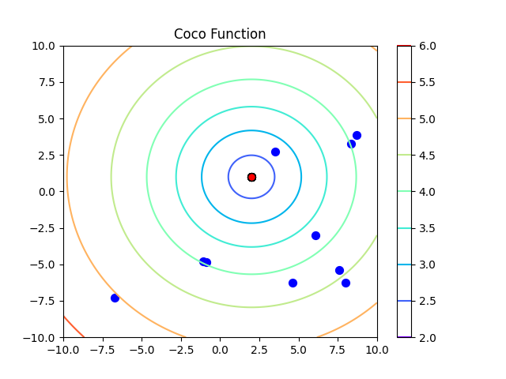
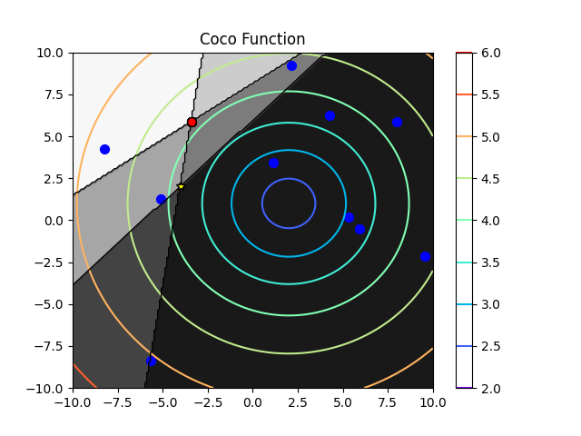
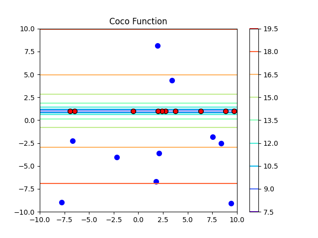
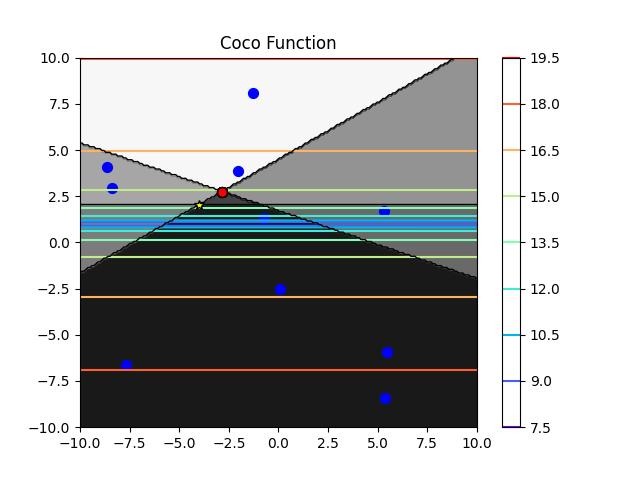
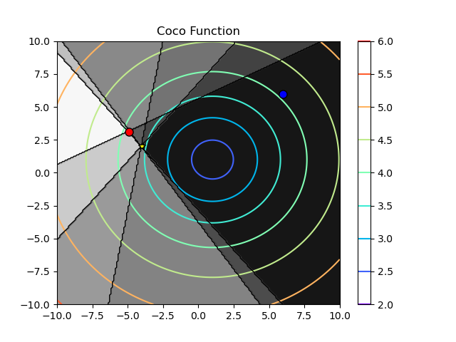
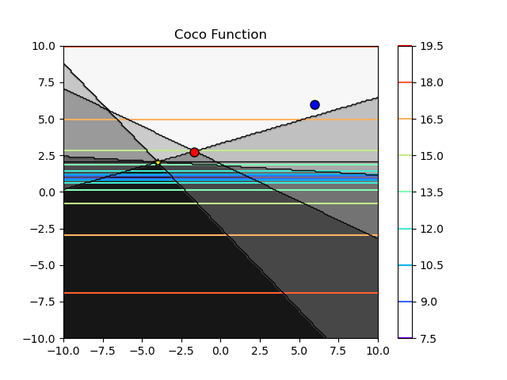

# Coco-optimization

## Kanban
| ToDo                                                                    | Doing                                     | Done                                                |
|-------------------------------------------------------------------------|-------------------------------------------|-----------------------------------------------------|
 |                                                                         |                                           | Read inputs from the input.json                     |
 |                                                                         |                                           | unconstrained condition for a `n x m` input `x` works ||                                                                         |                                    | constrained condition for `n x 2` input `x` works     |
|                                                                         |                                           | Refactor and generalize the inpu                    |
|                                                                         |                                           | constrained condition for `n x m` input `x` & `m > 2` |
|                                                                         | ~~Add the rest of the test functions~~    |                                                     |
| ~~Add Rastrigin function (F15 in bbob testsuite)~~                      |                                           |                                                     |
|  |                                           | Use IOH library to implement functions              |
|  |  |  Implement constraints in an efficient way                                                   |
|  |                                           | Generalize the process of biases `b` generation in `compute_g` function   |

### Feb 20th, 2023
1. Compute a and b through randomly sampling from an isotropic multivariate normal distribution.
2. Refactor the test_functions_coco file.

### Feb 5th, 2023
1. implement error function to check the accuracy of the optimization method used in scipy
2. implement constraints in an efficient way

### Feb 3rd, 2023
1. Use IOH library for our code (Unconstrained functions both for `get_f` and optimizations)

### Jan 10th, 2023
1. Extension to higher dimensions constraints
2. Add seed to constraints

### December 14th, 2022
The following implementations has been done to the code:
1. The first issue is fixed by removing unnecessary part.
2. The second issue is fixed with the following description:

`scipy.minimize()` is designed to minimize an m-dimensional point at each time. Therefore, when calling it for `n` m-dimensional points (`n x m` input `x`), it only minimizes the first point and shows the following warning:

DeprecationWarning: Use of `minimize` with `x0.ndim != 1` is deprecated. Currently, singleton dimensions will be removed from `x0`, but an error will be raised in SciPy 1.11.0. opti_result = minimize(object_function.

To fix this issue, I get the input `x` as a `n x m`, while calling `scipy.minimize()` in a `for` loop for each point separately. The output is stored in the `result` variable located in `main.py`. Here are the results of minimizing 10 points in both constrained and unconstrained cases:

3. The code structure changed. It contains 4 main parts of `main.py`, `optimizer.py`, `coco_test_functions.y`, and `figure.py`. So far, all parameters can be described in the `model.py` except `xopt`, `fopt`, `ystar`, and `x_init`. These four variables are temporary defined in `main.py`. `optimizer.py` simulate the minimization process and `coco_test_function.py` computes the objective function and the constraints.

### December 6th, 2022
Optimization results for test function (F1) with 5 constraints:

Blue point: Initial guess
Red point: solution 

Results for test function (F2) with 5 constraints:

TODO:

- [ ] Add the rest of the test functions
- [ ] Generalize the process of biases `b` generation in `compute_g` function 
- [x] Read inputs from the input.json (finished)
